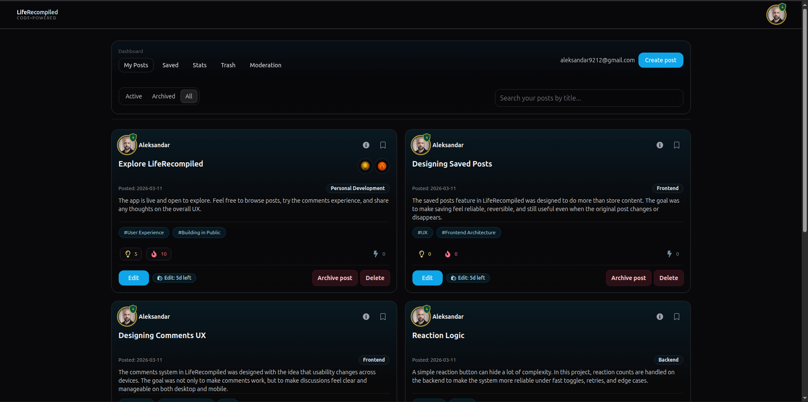
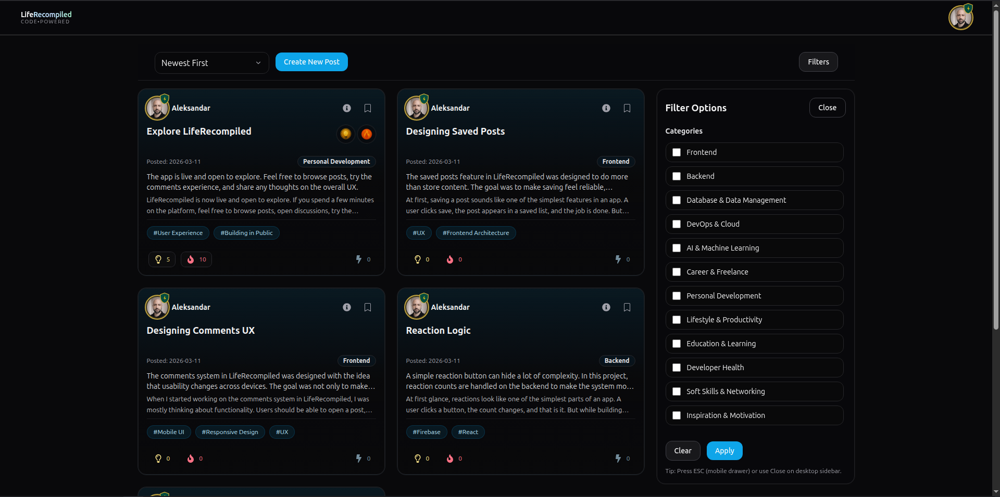
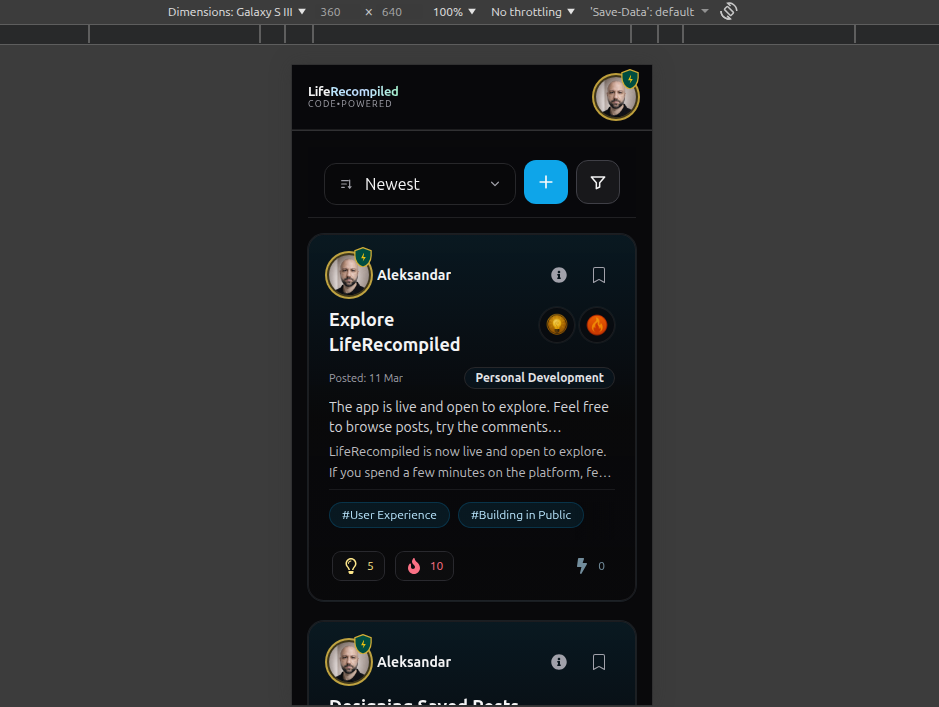
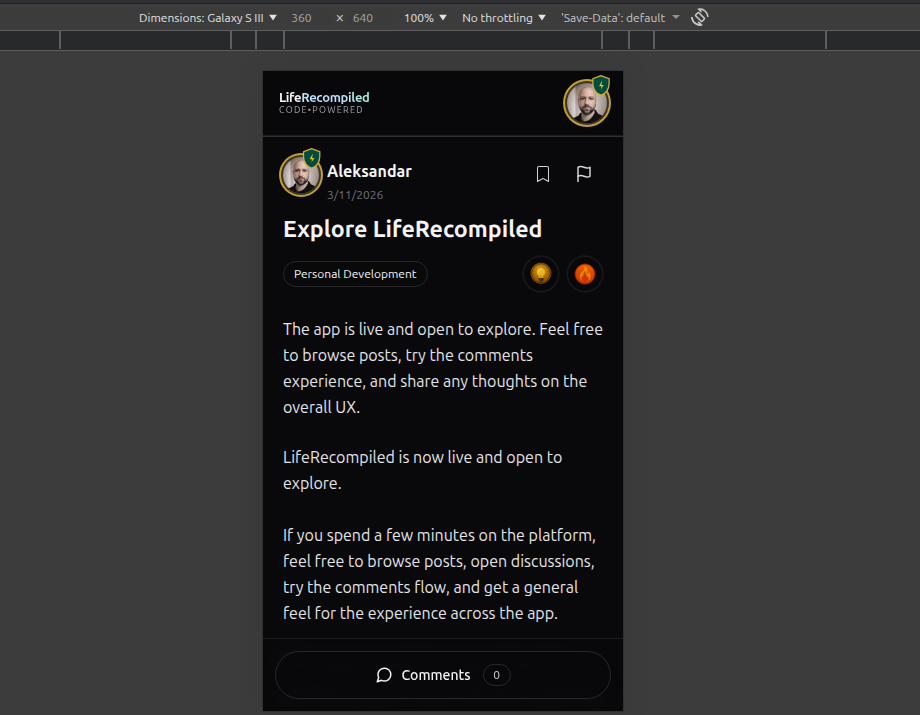

# LifeRecompiled

**LifeRecompiled** is a production-style **React/Firebase engineering case study** built around a community/blog app surface.

It started as a simple blog app and evolved into a full-stack study project focused on practical Firebase architecture, authentication, Firestore data modeling, Cloud Functions, security rules, resilient UI flows, and real-world edge cases.

The goal of the project is not to present a social network or startup product with user traction. The community/blog surface exists so the app can demonstrate realistic product flows while the main value is the engineering work behind them.

---

## TL;DR

LifeRecompiled demonstrates:

- community-style posts, comments, reactions, saved posts, profiles, dashboard, and moderation surfaces
- Firebase Auth with protected routes, email verification, and role-aware UI
- Firestore data modeling with public content, private saved-post subcollections, reports, and internal correctness collections
- Cloud Functions v2 for reaction aggregates, badges, stats, privileged deletion, comment creation, and scheduled cleanup
- deterministic reaction documents plus idempotency markers and a reaction ledger to reduce counter drift
- soft delete, Trash restore, permanent cascade delete, and scheduled purge
- resilient UX patterns such as ghost saved cards, Undo rollback, skeletons, modals, mobile comments sheet, and stable toast IDs
- route-level lazy loading, navigation-aware route prefetching, and a lightweight dark UI baseline
- controlled production demo content and avatar tooling for screenshots, private preview, and manual review
- practical security-rule boundaries and honest MVP limitations

---

## Demo

- Live: [liferecompiled.com](https://liferecompiled.com)
- Repository: [GitHub](https://github.com/cole92/liferecompiled)
- Public About page: `/about`
- Support & feedback route: `/report` — public
- Demo content: controlled seeded production content used for screenshots, private preview, and manual UX review

---

## Screenshots

### Desktop dashboard

<p align="center">
  
</p>

### Desktop filters

<p align="center">
  
</p>

### Mobile views

<table>
  <tr>
    <td align="center"><strong>Mobile feed</strong></td>
    <td align="center"><strong>Mobile post details</strong></td>
  </tr>
  <tr>
    <td align="center">
      
    </td>
    <td align="center">
      
    </td>
  </tr>
</table>

---

## Table of contents

- [Why this project exists](#why-this-project-exists)
- [Tech stack](#tech-stack)
- [Core product surface](#core-product-surface)
- [Architecture at a glance](#architecture-at-a-glance)
- [Frontend architecture](#frontend-architecture)
- [Data model](#data-model)
- [Cloud Functions v2](#cloud-functions-v2)
- [Backend correctness highlights](#backend-correctness-highlights)
- [Firestore security rules model](#firestore-security-rules-model)
- [UX engineering highlights](#ux-engineering-highlights)
- [Performance and demo-readiness highlights](#performance-and-demo-readiness-highlights)
- [Known limitations and honest caveats](#known-limitations-and-honest-caveats)
- [Local development](#local-development)
- [Deployment notes](#deployment-notes)
- [Testing and CI](#testing-and-ci)
- [Engineering notes / lessons learned](#engineering-notes--lessons-learned)
- [Roadmap](#roadmap)
- [Author](#author)

---

## Why this project exists

LifeRecompiled was built as a long-form learning and portfolio project.

The app uses a familiar community/blog product surface, but the project is mainly an engineering case study. It was built to explore and practice:

- Firebase Auth and app-level auth state
- protected routes and role-aware UI
- Firestore data modeling
- Firestore security rules
- Cloud Functions v2
- callable functions vs direct client writes
- Firestore trigger retries and idempotency
- backend-maintained aggregates
- soft delete vs hard delete lifecycles
- moderation/reporting workflows
- resilient client-side joins
- pagination and query constraints
- practical UX states in a real app

A good way to describe the project:

```text
A production-style React/Firebase engineering case study with a community/blog app surface.
```

---

## Tech stack

### Frontend

- React + Vite
- React Router
- Tailwind CSS
- Firebase Web SDK
- react-toastify
- react-tooltip
- Recharts
- dayjs
- Cloudinary unsigned client upload flow
- CSS transitions and performance-conscious loading states

### Backend / platform

- Firebase Auth
- Firestore
- Firebase Hosting
- Cloud Functions v2
- Cloudinary image hosting and best-effort cleanup
- GitHub Actions CI

### Runtime notes

- App development uses the root `.nvmrc`
- Cloud Functions use `functions/.nvmrc` and `functions/package.json`
- Cloud Functions runtime: Node 20
- Cloud Functions region: `europe-central2`

---

## Core product surface

### Auth and access control

- Email/password registration and login
- Forgot password flow with neutral reset messaging
- Email verification gate through global auth state
- Protected dashboard/account routes
- Auth-aware action guards for comments, reactions, saves, content reports, and dashboard access
- Admin role derived from user profile data

### Feed and posts

- Public feed with cursor pagination
- Sort modes: Newest, Oldest, Trending
- Category filtering with Firestore query constraints
- Post normalization before rendering
- Author enrichment with safe fallback UI
- Create/edit post flow
- Curated tag picker with a maximum of 5 tags
- My Posts management surface with server-side title-prefix search
- Edit-window and archived/read-only behavior in the UI

### Comments

- Realtime comment threads
- Nested replies using parent references
- Soft delete flow
- Comment edit UI
- Comment likes and likes modal
- Report flow for comments
- Mobile-first comments sheet
- Controlled/subscribed comment rendering for reuse across surfaces

### Reactions and badges

- Deterministic reaction document IDs
- Transaction-based client reaction toggles
- Cloud Functions-maintained reaction counts
- Badge logic for trending / most inspiring / top contributor style states
- Self-powerup backend rejection
- Session-throttled reaction help toasts

### Saved posts

- Private saved-post subcollection per user
- Snapshot metadata captured at save time
- Saved list pagination
- Resilient `Promise.allSettled` joins
- Ghost cards when the original post is missing or unavailable
- Optimistic unsave with timed Undo and rollback
- Visible feed save-state chunking for Firestore `in` query limits

### Dashboard and profiles

- Protected dashboard route area
- My Posts
- Saved Posts
- Stats
- Trash
- Create/Edit
- Settings
- Admin moderation surface
- Public profile pages
- Profile stats and top posts
- Avatar upload, zoom, and crop/reposition behavior

### Moderation and support

- User-created reports for posts/comments
- Admin report list and target navigation
- Admin hard-delete path from post details
- Public support/feedback route at `/report`
- Support route builds email/mailto/clipboard payloads with debug context

Moderation is intentionally MVP-light. It is not a full moderation operations system with statuses, assignments, audit logs, or resolved queues.

---

## Architecture at a glance

### Client

The React app handles:

- screen routing
- auth-aware route protection
- UI state
- Firestore reads
- safe user-owned writes
- reaction toggle document writes
- optimistic UI flows
- dashboard state
- responsive/mobile surfaces

### Firebase platform

Firebase provides:

- identity through Firebase Auth
- app data through Firestore
- trusted backend logic through Cloud Functions
- static hosting through Firebase Hosting
- rules/indexes configuration through tracked Firebase files

### Cloud Functions

Cloud Functions handle:

- reaction aggregate maintenance
- badge updates
- user stats updates
- privileged cascade deletes
- scheduled Trash purge
- scheduled trending expiry
- comment creation validation/rate limiting
- comment soft delete
- best-effort Cloudinary cleanup

### Realtime sync model

Selected realtime behavior:

- comments update through `onSnapshot`
- dashboard Trash count updates through realtime subscription
- post detail surfaces can reflect updated reaction/badge state
- reactions use deterministic docs so active state can be checked without listing all reactions

---

## Frontend architecture

The frontend is organized around practical separation:

- `src/pages` — route-level screens
- `src/components` — reusable UI and feature components
- `src/services` — Firestore/service calls
- `src/queries` — Firestore query builders
- `src/mappers` — Firestore document normalization
- `src/context` — auth/search state
- `src/hooks` — shared React hooks
- `src/utils` — reusable helpers
- `src/constants` — shared app constants

Important frontend patterns:

- AuthProvider wraps Firebase auth state into app-level state
- ProtectedRoute gates account-only routes
- DashboardLayout owns shared dashboard state and passes it through Outlet context
- query builders keep Firestore query constraints away from components
- mappers normalize unsafe Firestore data before rendering
- services isolate reads/writes and author enrichment
- UI fallbacks prevent one missing document from breaking an entire screen
- cursor pagination uses explicit page boundaries
- toast utilities centralize and de-dupe user feedback
- route-level lazy loading keeps large route modules out of the initial app load
- navigation-aware route prefetching warms likely next routes on user intent without making those routes eager

This is not an enterprise architecture, but it is structured enough to show real separation of concerns in a portfolio-scale app.

---

## Data model

High-level Firestore model:

- `posts/{postId}`
  - content fields
  - author/user reference
  - category/tags
  - deleted/archived state
  - reaction counts
  - badge state
  - `lastHotAt` for trending expiry

- `comments/{commentId}`
  - post reference
  - author reference
  - optional parent reference for replies
  - content
  - timestamps
  - soft-delete state
  - likes

- `users/{uid}`
  - public profile fields
  - role
  - public badge mirror

- `users/{uid}/savedPosts/{postId}`
  - saved timestamp
  - snapshot metadata
  - source post reference data used by the Saved Posts UI

- `reactions/{postId__uid__type}`
  - deterministic reaction toggle document

- `userStats/{uid}`
  - dashboard/user statistics
  - maintained by backend logic

- `reports/{compositeReportId}`
  - user-created report documents
  - admin-readable

- `processedEvents/{type__eventId}`
  - internal idempotency markers

- `reactionLedger/{reactionId}`
  - internal reaction count pairing state

- `appSettings/reactionThresholds`
  - configurable/fallback reaction thresholds

Note: some legacy field names exist in parts of the codebase, especially around comments (`postID`, `parentID`, `userID`). Those are historical implementation details and should be considered when refactoring or documenting the model further.

---

## Cloud Functions v2

**Region:** `europe-central2`  
**Runtime:** Node 20  
**Main patterns:** callable functions, Firestore triggers, schedulers, idempotency markers, reaction ledger, stale-event guards

| Function | Trigger / type | Purpose |
| --- | --- | --- |
| `ping` | HTTP `onRequest` | Healthcheck |
| `addCommentSecure` | Callable `onCall` | Create comment with validation/rate-limit behavior |
| `softDeleteComment` | Callable `onCall` | Soft delete a comment as author/admin |
| `deleteCommentAndChildren` | Callable `onCall` | Hard delete a comment subtree |
| `deletePostCascade` | Callable `onCall` | Hard delete a post and related data as author/admin |
| `updateUserStatsOnPostCreateV2` | Firestore `onCreate` | Update author stats when posts are created |
| `bumpRestoredOnPostUpdate` | Firestore `onUpdate` | Detect restored posts and update stats |
| `cleanupExpiredPostsV2` | Scheduled | Purge Trash posts older than retention window |
| `expireTrendingPostsV2` | Scheduled | Expire stale trending badges |
| `reactionsIdeaOnCreateV2 / OnDeleteV2` | Firestore triggers | Maintain IDEA reaction counts and badge state |
| `reactionsHotOnCreateV2 / OnDeleteV2` | Firestore triggers | Maintain HOT reaction counts, trending badge, and `lastHotAt` |
| `reactionsPowerupOnCreateV2 / OnDeleteV2` | Firestore triggers | Maintain POWERUP counts, stats, and top-contributor style badge state |

---

## Backend correctness highlights

### 1. Deterministic reaction toggles

Reaction document ID:

```text
postId__uid__reactionType
```

This gives each user one reaction document per post/type and makes active-state checks simple.

The client can toggle the deterministic document, while Cloud Functions maintain the derived counts and badge state.

---

### 2. Idempotency markers

Firestore triggers can retry. Without idempotency, the same event can be applied more than once.

The app uses internal `processedEvents` documents keyed by event identity to avoid duplicate aggregate work.

---

### 3. Reaction ledger

Idempotency alone does not answer whether a reaction was actually counted before a delete event arrives.

The `reactionLedger` records whether a reaction is currently considered counted/active from the backend's perspective.

This helps avoid counter drift from:

- stale create events
- stale delete events
- rapid toggle sequences
- orphan delete events
- retries

---

### 4. Stale event guards

Reaction triggers check whether the underlying reaction document state still matches the event being processed.

Examples:

- create event arrives but the document was already deleted
- delete event arrives but the document was already recreated

Those cases are skipped instead of blindly updating counters.

---

### 5. Counter clamping

Decrements clamp counters at `>= 0` as a final safety guard against negative counts.

---

### 6. Soft delete and hard delete lifecycle

Deletion is modeled in two phases:

1. soft delete moves content into Trash / deleted state
2. hard delete permanently removes related data through privileged backend logic

Scheduled cleanup purges old Trash items after the retention window.

---

### 7. Best-effort external cleanup

Cloudinary cleanup is treated as best-effort. Database deletion should not fail just because an external asset cleanup fails.

Cloudinary cleanup only applies where the relevant `imagePublicId` exists.

---

## Firestore security rules model

The rules aim to enforce important ownership and role boundaries:

- public read access for appropriate public content
- private saved posts under each user
- user-owned content creation/update/deletion boundaries
- deterministic reaction create/delete contract
- no reaction list/query access
- userStats read-only to clients
- internal event/ledger collections denied to clients
- reports can be created by authenticated users and read by admins
- users can be fetched individually for public profile/author display while broad user listing is restricted
- admin access is based on user profile role

### Important security-rule caveat

Some derived post fields are maintained by Cloud Functions, but current rules may still allow a post owner to update more post fields than ideal.

For that reason, the most accurate wording is:

```text
Cloud Functions-maintained aggregates
```

not:

```text
fully backend-authoritative aggregates
```

unless post field-level restrictions are tightened in a future hardening pass.

---

## UX engineering highlights

### Saved Posts resilience

Saved Posts is one of the strongest product-quality systems in the app:

- saved docs live under each user
- snapshot metadata is stored at save time
- `Promise.allSettled` keeps the list usable if one joined post fails
- ghost cards preserve context when a source post is missing
- optimistic unsave includes timed Undo
- rollback handles failed restore/save operations

### Mobile comments sheet

The comments experience includes a mobile sheet pattern with:

- focus handling
- body scroll lock
- ESC/backdrop behavior
- drag-to-close style behavior
- collapsed composer behavior
- realtime thread rendering

### Toast system

Toasts are centralized through utility helpers:

- stable toast IDs
- de-dupe/update behavior
- reduced feedback spam
- consistent success/error/info/warning handling

### Loading and empty states

The app uses:

- skeleton loading
- empty-state components
- end-of-list messaging
- guarded action messages
- disabled/readonly states
- progressive loading states

### Accessibility-minded UI details

The app includes pragmatic accessibility helpers:

- skip link
- focus rings
- aria states
- `aria-live` messaging in selected places
- keyboard handling for overlays
- scroll lock on modal/sheet surfaces

This should not be presented as a full accessibility audit, but it is a meaningful frontend quality signal.

---

## Performance and demo-readiness highlights

### Route-level lazy loading

Major route modules are lazy-loaded so the initial Home/Auth experience does not pay upfront for every feature area.

Lazy-loaded areas include:

- PostDetails
- About
- Profile
- Support / ReportIssue
- dashboard child routes
- Stats / Recharts-heavy surfaces
- Create/Edit editor flows
- Settings
- Moderation

Home, Login, Register, and core app infrastructure remain eager so the primary entry points stay immediate and simple.

### Navigation-aware route prefetching

The app also includes navigation-aware route intent prefetching.

This keeps lazy loading active while reducing visible cold-route pauses when a user clearly intends to navigate.

Examples:

- desktop header links can prefetch on hover/focus
- dashboard tabs can prefetch their target route
- avatar dropdown items can prefetch visible account/support/about routes
- post cards and author links can warm PostDetails/Profile routes
- mobile avoids aggressive prefetching on large scrollable cards to preserve scroll feel

### Lightweight dark UI baseline

The final UI direction intentionally avoids broad glassmorphism and heavy repeated blur/motion patterns.

The design now favors:

- solid dark surfaces
- subtle borders
- clear typography hierarchy
- skeleton/card loading states
- stable mobile scroll
- selective accents instead of global glow/blur stacking

Repeated decorative motion and expensive blur-heavy surfaces were reduced after performance testing.

### Saved bookmark loading state

Saved/bookmark controls distinguish between:

```text
unknown / loading
saved = true
saved = false
```

This prevents saved posts from briefly looking unsaved during hard refresh or initial route load.

The accepted behavior is a neutral loading placeholder followed by the correct saved/unsaved state.

### Controlled production demo data

Production demo content is seeded through controlled local admin scripts rather than manually-created random test data.

The seed approach supports:

- portfolio screenshots
- private preview
- Home feed validation
- Profile validation
- SavedPosts validation
- comments/replies validation
- reaction/Cloud Function validation

Seeded documents are marked so they can be identified and removed later.

Demo avatar update tooling attaches Cloudinary-hosted avatar images to seeded demo users without changing runtime app behavior.

---

## Known limitations and honest caveats

This project is a portfolio-grade engineering case study, not a finished commercial SaaS product.

Important current limitations:

- Some product policies are UI-enforced rather than fully backend/rules-enforced.
- The 7-day post edit window is mostly UI-level behavior.
- The 10-minute comment edit window is mostly UI-level behavior.
- Locked/archive/read-only behavior is mostly UI-level behavior.
- Post aggregate-like fields are maintained by Cloud Functions but not fully protected from owner mutation under current post rules.
- Direct comment creation may still be possible through Firestore rules, which means callable comment rate limiting is not completely unbypassable.
- Comment likes use a simpler client-managed array approach and are not as robust as the post reaction system.
- Moderation is MVP-light and does not include a full report lifecycle, audit log, assignments, or resolved queue.
- Profile top posts / total reaction calculations may need stronger aggregate modeling at larger scale.
- Automated testing is minimal.
- Backup automation was documented during development, but backup infrastructure is not managed as infrastructure-as-code in this repository.
- Cloudinary cleanup is best-effort and only applies when the relevant public ID is available.
- The Vite main chunk warning is known; route-level lazy loading and intent prefetch are implemented, while manual chunk work is left for later only if it becomes worth the complexity.

These limitations are useful future hardening areas and are intentionally documented rather than hidden.

---

## Local development

### Prerequisites

- Node version from root `.nvmrc`
- npm
- Firebase CLI
- Optional: nvm

### Install

```bash
npm install
```

### Environment variables

Copy the example environment file:

```bash
cp .env.example .env
```

Then fill in the required values for your own Firebase/Cloudinary setup.

Required frontend environment variables:

```text
VITE_FIREBASE_API_KEY=
VITE_FIREBASE_AUTH_DOMAIN=
VITE_FIREBASE_PROJECT_ID=
VITE_FIREBASE_STORAGE_BUCKET=
VITE_FIREBASE_MESSAGING_SENDER_ID=
VITE_FIREBASE_APP_ID=
VITE_CLOUDINARY_CLOUD_NAME=
VITE_CLOUDINARY_UPLOAD_PRESET=
VITE_SUPPORT_EMAIL=
```

Real `.env` and `.env.staging` files should not be committed.

### Run locally

```bash
npm run dev
```

Vite dev server:

```text
http://localhost:5173
```

### Quality checks

```bash
npm run lint
npm run test
npm run build
```

Build output:

```text
dist/
```

---

## Deployment notes

The repo includes Firebase configuration for:

- Firebase Hosting
- SPA rewrites
- Firestore rules
- Firestore indexes
- Cloud Functions source
- Firebase project aliases

Typical deploy commands:

```bash
firebase deploy --only hosting
firebase deploy --only functions
firebase deploy --only firestore:rules
firebase deploy --only firestore:indexes
```

Environment/project selection should be handled carefully through Firebase project aliases.

Operational work such as staging backup planning was documented separately during development. It is not represented as repo-managed infrastructure in this repository.

---

### Environment discipline

The project used Firebase project aliases to separate staging and production workflows.

The staging setup was used as a safer place to test hosting, rules, functions, and data-related changes before treating the production project as the stable target.

Some operational work, including staging backup planning/export documentation, was handled outside the repository rather than as repo-managed infrastructure.

---

## Testing and CI

The project includes a minimal Vitest smoke-level test setup.

GitHub Actions CI runs on push and pull request to `main`:

```text
npm install
npm run lint
npm run test
npm run build
```

Current test coverage is intentionally described as minimal. Expanding meaningful automated coverage is a future improvement.

---

## Engineering notes / lessons learned

These are practical notes that came directly from building the project:

- Firestore triggers can retry, so aggregate updates need idempotency.
- Fast reaction toggles can create stale create/delete events.
- A reaction ledger helps track whether an increment was actually applied before a decrement.
- TTL is cleanup, not correctness.
- Firestore TTL is useful for technical marker cleanup, but Trash cleanup is handled by scheduled functions.
- Soft delete gives users a safer recovery window than immediate hard delete.
- External cleanup, such as Cloudinary asset deletion, should be best-effort.
- Firestore indexes become part of the architecture once queries combine filters and sorting.
- Client-side joins need failure handling; `Promise.allSettled` helps one failed item not break an entire list.
- Some MVP policies are UI-enforced and would need stricter rules/functions before a production release.
- Route-level lazy loading improves initial payload, but cold lazy routes still need good loading states or intent prefetching.
- Loading/unknown boolean states should not be rendered as false states; they need a separate placeholder state.
- A good README should describe what the code actually proves, not what the app might become later.

---

## Roadmap

Focused future improvements:

- Harden Firestore rules around post aggregate fields and comment creation paths
- Expand tests beyond smoke coverage
- Improve moderation workflow with statuses/actions if needed
- Add deeper interview/case-study documentation for reaction correctness
- Continue monitoring the known Vite chunk warning; route-level lazy loading and intent prefetch are already implemented
- Review and modernize remaining ESLint/flat-config warnings
- Improve profile aggregate scalability if the dataset grows

Future ideas should be treated as future improvements, not current features.

---

## Author

Created by **Aleksandar Todorović**.

This project is part of a portfolio focused on React, Firebase, product-quality frontend work, and production-style full-stack engineering practice.